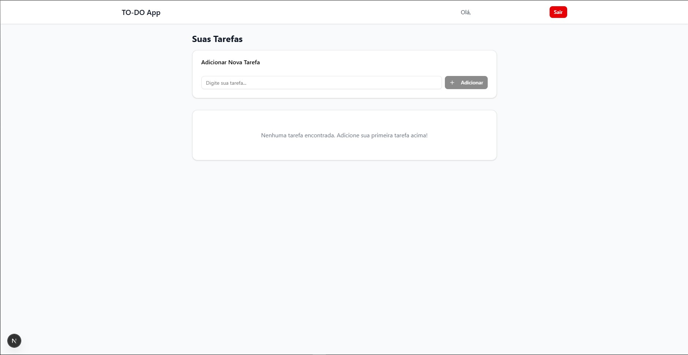

# TO-DO App com Next.js 15 + Supabase



## 📋 Descrição do Projeto

Este é um aplicativo de TO-DO (lista de tarefas) desenvolvido com Next.js 15, React (sem TypeScript), Tailwind CSS 4, Supabase e shadcn/ui. O projeto inclui sistema de autenticação completo e operações CRUD para gerenciamento de tarefas.

## 🚀 Tecnologias Utilizadas

- **Next.js 15**: Framework React com App Router
- **React**: Biblioteca JavaScript para interfaces
- **Tailwind CSS 4**: Framework CSS para estilização
- **Supabase**: Backend-as-a-Service para autenticação e banco de dados
- **shadcn/ui**: Biblioteca de componentes UI
- **Lucide React**: Ícones

## 📁 Estrutura do Projeto

```
todo-supabase/
├── src/
│   ├── app/
│   │   ├── dashboard/
│   │   │   └── page.js          # Página principal do TO-DO
│   │   ├── login/
│   │   │   └── page.js          # Página de login/cadastro
│   │   ├── layout.js            # Layout principal
│   │   ├── page.js              # Página inicial (redirecionamento)
│   │   └── globals.css          # Estilos globais
│   ├── components/
│   │   └── ui/                  # Componentes shadcn/ui
│   │       ├── button.js
│   │       ├── input.js
│   │       ├── card.js
│   │       └── dialog.js
│   ├── contexts/
│   │   └── AuthContext.js       # Contexto de autenticação
│   └── lib/
│       ├── supabase.js          # Cliente Supabase
│       └── utils.js             # Utilitários
├── .env.local                   # Variáveis de ambiente
└── package.json
```

## 🔧 Configuração e Instalação

### 1. Pré-requisitos

- Node.js 20+
- npm ou yarn
- Conta no Supabase

### 2. Instalação

```bash
# Clone o projeto
cd todo-supabase

# Instale as dependências
npm install

# Configure as variáveis de ambiente
# Edite o arquivo .env.local com suas credenciais do Supabase
```

### 3. Configuração do Supabase

#### Tabelas necessárias:

**Tabela `profiles`:**

```sql
CREATE TABLE profiles (
  id UUID PRIMARY KEY DEFAULT auth.uid(),
  username TEXT UNIQUE NOT NULL,
  avatar_url TEXT
);
```

**Tabela `todos`:**

```sql
CREATE TABLE todos (
  id UUID PRIMARY KEY DEFAULT gen_random_uuid(),
  user_id UUID REFERENCES profiles(id),
  task TEXT NOT NULL,
  is_complete BOOLEAN DEFAULT false,
  inserted_at TIMESTAMP WITH TIME ZONE DEFAULT now()
);
```

#### Configuração de RLS (Row Level Security):

```sql
-- Habilitar RLS nas tabelas
ALTER TABLE profiles ENABLE ROW LEVEL SECURITY;
ALTER TABLE todos ENABLE ROW LEVEL SECURITY;

-- Políticas para profiles
CREATE POLICY "Users can view own profile" ON profiles
  FOR SELECT USING (auth.uid() = id);

CREATE POLICY "Users can insert own profile" ON profiles
  FOR INSERT WITH CHECK (auth.uid() = id);

CREATE POLICY "Users can update own profile" ON profiles
  FOR UPDATE USING (auth.uid() = id);

-- Políticas para todos
CREATE POLICY "Users can view own todos" ON todos
  FOR SELECT USING (auth.uid() = user_id);

CREATE POLICY "Users can insert own todos" ON todos
  FOR INSERT WITH CHECK (auth.uid() = user_id);

CREATE POLICY "Users can update own todos" ON todos
  FOR UPDATE USING (auth.uid() = user_id);

CREATE POLICY "Users can delete own todos" ON todos
  FOR DELETE USING (auth.uid() = user_id);
```

### 4. Executar o projeto

```bash
npm run dev
```

O projeto estará disponível em `http://localhost:3000`

## 🎯 Funcionalidades

### ✅ Implementadas:

- **Autenticação completa**: Login, cadastro e logout
- **Redirecionamento automático**: Usuários não logados são redirecionados
- **Interface responsiva**: Funciona em desktop e mobile
- **CRUD de tarefas**: Adicionar, editar, marcar como completo e remover
- **Persistência de dados**: Dados salvos no Supabase
- **Componentes reutilizáveis**: Usando shadcn/ui

### 🔄 Funcionalidades principais:

1. **Login/Cadastro**: Formulário único que alterna entre modos
2. **Dashboard**: Página principal com lista de tarefas
3. **Adicionar tarefa**: Campo de input com botão
4. **Editar tarefa**: Modal para edição
5. **Marcar como completa**: Checkbox para cada tarefa
6. **Remover tarefa**: Botão de exclusão
7. **Logout**: Botão para sair da conta

## 🎨 Design e UX

- **Design limpo e moderno**: Usando Tailwind CSS
- **Componentes consistentes**: shadcn/ui para uniformidade
- **Feedback visual**: Estados de loading e mensagens de erro
- **Responsividade**: Adaptável a diferentes tamanhos de tela
- **Acessibilidade**: Labels e aria-labels apropriados

## 🔒 Segurança

- **Row Level Security**: Usuários só acessam seus próprios dados
- **Autenticação JWT**: Tokens seguros do Supabase
- **Validação client-side**: Campos obrigatórios e formatos
- **Sanitização**: Dados tratados antes de salvar

## 📱 Responsividade

O projeto foi desenvolvido com mobile-first e é totalmente responsivo:

- **Desktop**: Layout completo com sidebar
- **Tablet**: Layout adaptado
- **Mobile**: Interface otimizada para toque

## 🚨 Problemas Conhecidos

1. **Erro no cadastro**: Pode ocorrer se o RLS não estiver configurado corretamente
   - **Solução**: Configurar as políticas RLS conforme documentado

## 🔄 Próximos Passos

1. Configurar RLS no Supabase
2. Adicionar validação de email
3. Implementar recuperação de senha
4. Adicionar categorias para tarefas
5. Implementar filtros e busca
6. Adicionar notificações

## 📞 Suporte

Para dúvidas ou problemas:

1. Verifique se as variáveis de ambiente estão corretas
2. Confirme se as tabelas do Supabase foram criadas
3. Verifique se o RLS está configurado
4. Consulte os logs do console para erros específicos
